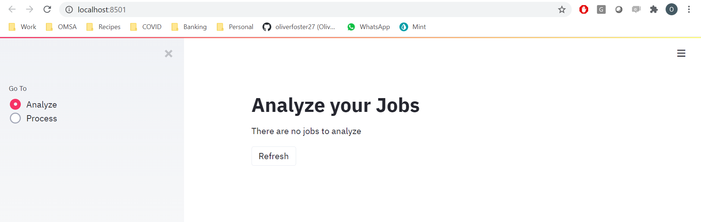
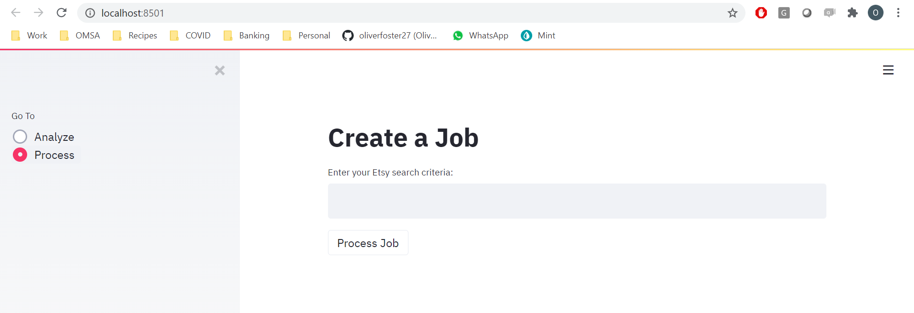
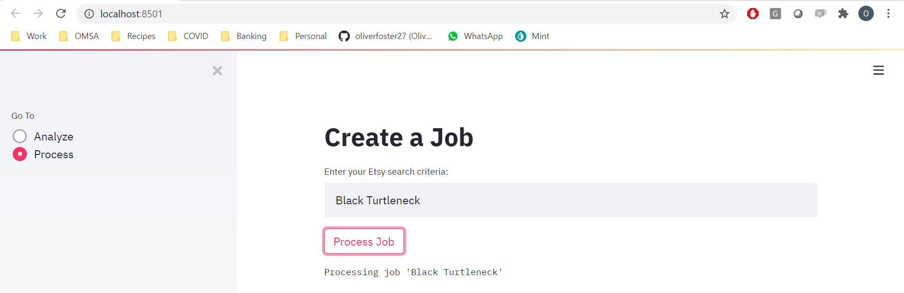
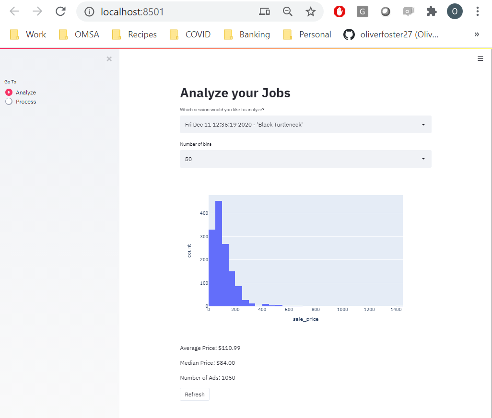

# Etsy Pricer

Determine the optimal price of an item to be sold on your Etsy
store relative to the search criteria used to find your item. This
project was inspired by my girlfriend who is always looking for the right
price to set for new items in her Etsy store. 
[Show her some love :)](https://www.etsy.com/ca/shop/Covu).

Using [Selenium](https://selenium-python.readthedocs.io/) 
for web scraping Etsy ads and [Streamlit](https://www.streamlit.io/) 
for front-end visualization: I created a web-app that will take an Etsy 
search criteria and return the optimal price for your store's 
new item. This project assumes that the optimal price is the 
median price: any lower and shoppers will assume it's cheaply made, 
and any more expensive shoppers will assume they are being ripped off.
Data collected during scraping is stored locally in the file database.db using 
[SQLite](https://www.sqlite.org/index.html). 

## Installation

Firstly you must clone this repository in the local directory of your choice:

```
git clone https://github.com/oliverfoster27/Etsy_Pricer.git
```

Now create a new python environment or activate an existing 
and install the requirements:

```
pip install requirements.txt
```

## Usage

Activate your python environment and start the app:

```
python main.py
```

The streamlit server will start and you will be prompted to navigate to
http://localhost:8501:

```
You can now view your Streamlit app in your browser.

Local URL: http://localhost:8501
Network URL: <REDACTED>
```

If this is the first time your app has run, 
you will be directed to an empty analysis page:



Click on "Process" on the left navigation bar 
and you will be taken to your job manager:



To create a job for your search criteria, simply type the search
into the text widget and click "Process Job". For example you can type
"Black Turtleneck" if you would like to price for such an item:



Once your job has started you will see the text "Processing job 'Job Name' ". 
You should now be able to navigate back to the Analyze tab to view the progress of your
current job:



If you navigate to this page and your job isn't posted - wait a second and click refresh.
It is possible the job has registered but has not parsed any Etsy ads yet. This job
will continue to update data on this page until it has parsed all ads for this criteria.
Click refresh if you would like to see the most up-to-date data from this job.